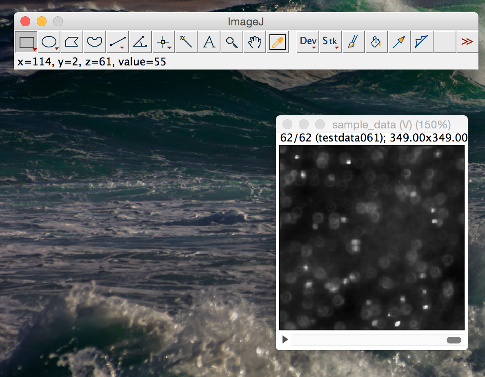
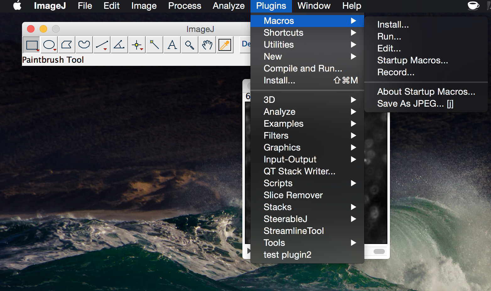
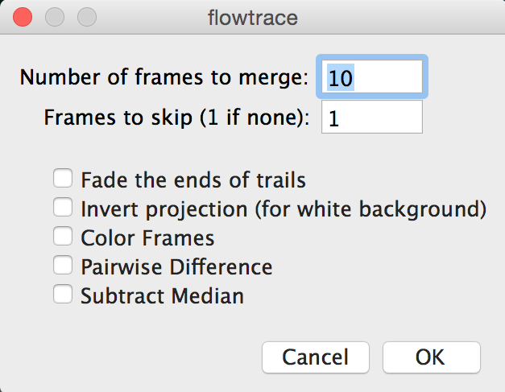

# flowtrace for ImageJ

Implementation of the flowtrace tool as a macro for ImageJ / Fiji

This has been tested in ImageJ32, ImageJ64, and Fiji.

William Gilpin, Vivek N. Prakash, and Manu Prakash, 2015

## Installation

Download the code and sample images from [the GitHub repository](https://github.com/williamgilpin/flowtrace_imagej)

Alternatively, on OSX/Linux you can initiate the download from the terminal using

	curl -OS https://github.com/williamgilpin/flowtrace_imagej/archive/master.zip

Or, using git

	git clone https://github.com/williamgilpin/flowtrace_imagej.git

## Running flowtrace

Open a folder containing an image time series as a stack or virtual stack

<!--  -->

In order to run the tool without installing, go to `Plugins > Macros > Run`

<!--  -->

Navigate to the folder into which you downloaded the tool and double click on it. You will be presented with a list of options for running the tool

<!--  -->

For "Number of frames to merge," select the number of frames that should be used to make each pathline. The larger this number, the longer the resulting pathlines (for best performance, this should be as large as possible while still smaller than the number of frames over which the unsteady flow noticeably changes). 

The remaining options are described in greater detail below. Click `OK` to continue. 

Now follow the prompt to choose a directory into which to save the output images. Click `OK` to run the tool.

## Installing as a permanent macro

If you find yourself using flowtrace on a regular basis, you may want to install it as a permanent macro in ImageJ or Fiji's plugins menu. The easiest way to do this is to manually drag the file into the folder `ImageJ/plugins` or `Fiji/Plugins` (located in the installation directory of Fiji or ImageJ). Restart Fiji or ImageJ after doing this.

## Options

When flowtrace is run, you are presented with the following options:

<!--  -->

+ Fade the ends of trails

	+ Linearly dim the pathlines in each image, such that the portion of the pathline that comes from frames further in the past appears dimmer.

+ Invert projections

	+ If you are using movies of dark objects against a light background (such as bright field microscope images, or a video of an insect flock or swarm), then invert the projection process in order to generate the appropriate pathlines

+ Color Frames

	+ In each frame of the resulting time series, color-code the pathlines by time. The portion of the streamline that is further in the past will appear more blue, while the more recent frames will be colored redder. The most recent frame is left untinted

+ Frames to skip

	+ If you don't want to project from every frame in the range of the time series (for example, if you want dotted lines, or if you think your data oversamples in time), then set "Frames to skip" to a number larger than 1. If you are not certain, leave this as 1.

+ Pairwise Difference

	+ Take the pairwise difference between all of the images in the time series.

	+ This works by default in Fiji. In order to make this work in other versions of ImageJ, please install the "Kymograph" plugin from [EMBL](http://www.embl.de/eamnet/html/kymograph.html). That plugin should be attributed to  J. Rietdorf, FMI Basel and A. Seitz, EMBL Heidelberg.

+ Subtract Median

	+ For each substack for which a pathline will be generated, subtract out the median of each pixel value. This option is good for eliminating backgound objects (or any objects that move slower than the tracer particles or moving organisms)

## Future

+ Subtract first frame of each series

Bug reports and pull requests are encouraged.